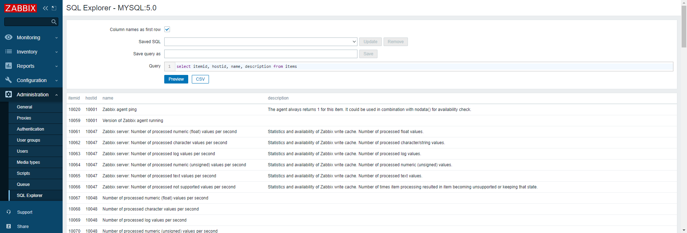

## SQL Explorer

Module allow to make queries to database and export result as `.csv` file. Queries can be saved and reused later.
Codemirror is used as query editor. It supports SQL syntax highlight and database table column names autocompletion.
